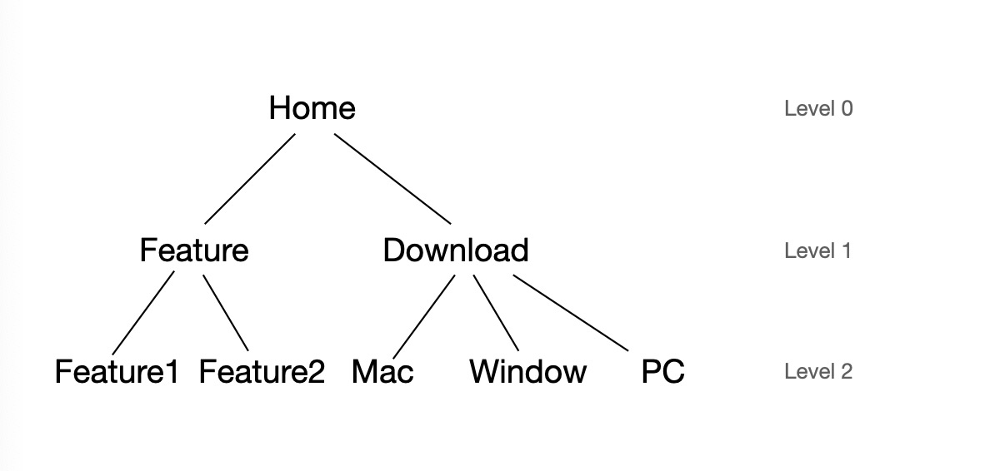

# 思路分析

最终目标是还原sitemap树。

单纯分析页面间跳转数据可以得到一个加权有向有环图，但是如果没有其他附加条件难以确定根结点。试着看看pv存在的意义。

需要确认一个前提：根结点的pv是最大的。

pv来源于两部分：直接访问和其他结点的跳转。

如果只有结点间跳转，流量会自顶向下逐量减少，是逻辑可控的。加入直接访问量，似乎就找不到可靠的切入点了。

那么反向思考一下：假设子结点的pv会大于根结点。路径的权重也会变化，难以确定真正的根结点。如果假设成立，则无法找到真正的根结点。
 
我认为最终生成的树是这样的

父结点只能跳转至子结点，一个结点只能有一个父结点。因此可以从根结点开始遍历生成树。